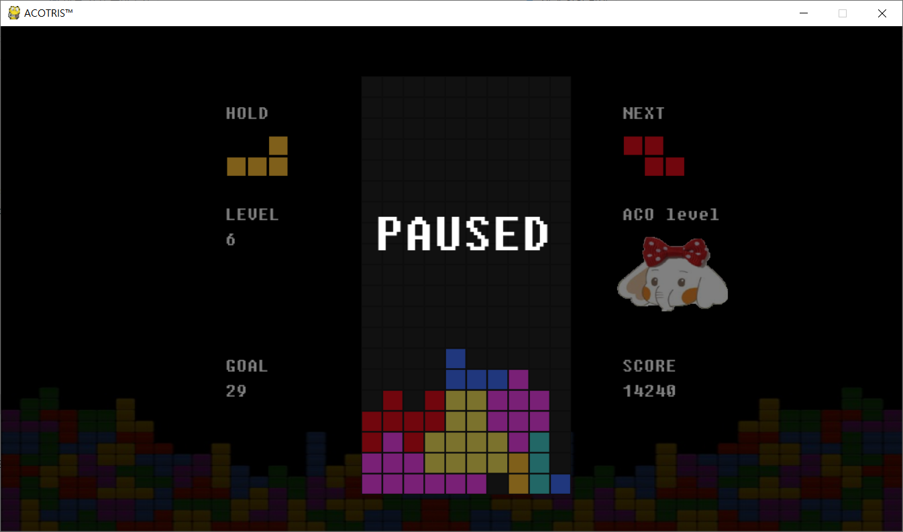
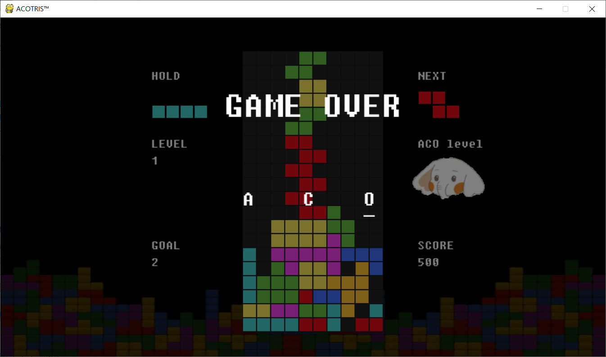

# 2019-2-OSSPC-MDJ-1

## Project Name
2019-2-OSSP-MDJ-1 (original source: [PYTRIS](https://github.com/k0626089/PYTRIS))

## Game
TETRIS

## Team Members
Yeonjin Kim, Seongyeon Choi, Seokjin Choi

## Development Environment
- Linux Ubuntu

- Python 3.7 (:heavy_check_mark: Check before playing)

## How to run
Download Package (pygame, screeninfo)

:warning: Use *pip install pygame*, *pip install screeninfo*

## Description
Tetris is the most addictive classical puzzle game in the world!

Enjoy **PYTRIS in DGU** with cute baby elephants! :elephant: :elephant: :elephant:

## How to play
The goal of Tetris is to score as many points as possible by clearing horizontal lines of Blocks. The player must rotate, move, and drop the falling Tetriminos inside the Matrix (playing field). Lines are cleared when they are filled with Blocks and have no empty spaces.

As lines are cleared, the level increases and Tetriminos fall faster, making the game progressively more challenging. If the Blocks land above the top of the playing field, the game is over.

## Game keys

- Space : move to the next Package

## Game Screen
- Start Screen

: Press Space key to watch ranking

- Ranking Screen

: Press Space key to watch Game Manual

- Manual Screen

: Press Space key to select Game Mode

- Mode Select Screen

: Select Mode by pressing keys and enjoy the game!

- Single Mode Play

- Multi Mode Play

- Pause Screen

: Pause and restart the game by pressing esc

- Game Over Screen

## Compared to original PYTRIS
1. Manual Screen added
2. Ranking Screen added
3. Multi Mode added
4. Game mode(easy, normal, hard) added
5. Ranking System modified
6. GUI modified

## Demo video

- Original Pytris

- PYTRIS in DGU

## License
MIT License

THE SOFTWARE IS PROVIDED "AS IS", WITHOUT WARRANTY OF ANY KIND, EXPRESS OR IMPLIED, INCLUDING BUT NOT LIMITED TO THE WARRANTIES OF MERCHANTABILITY, FITNESS FOR A PARTICULAR PURPOSE AND NONINFRINGEMENT. IN NO EVENT SHALL THE AUTHORS OR COPYRIGHT HOLDERS BE LIABLE FOR ANY CLAIM, DAMAGES OR OTHER LIABILITY, WHETHER IN AN ACTION OF CONTRACT, TORT OR OTHERWISE, ARISING FROM, OUT OF OR IN CONNECTION WITH THE SOFTWARE OR THE USE OR OTHER DEALINGS IN THE SOFTWARE.
